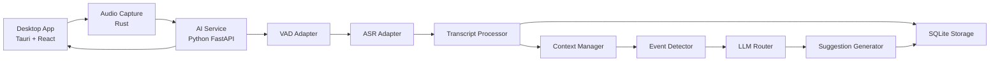
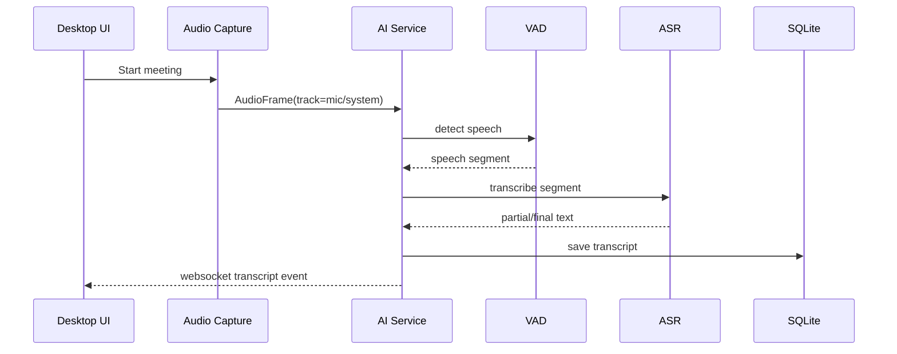
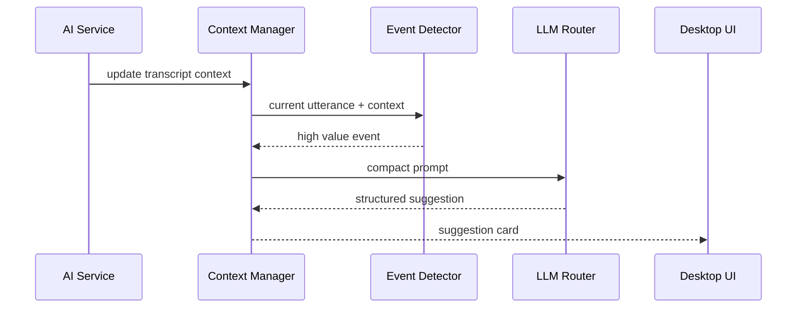

# 02 技术架构设计

## 1. 架构原则

架构核心原则：

```text
本地优先
流式处理
模块解耦
接口可替换
先闭环后优化
```

## 2. 总体架构



## 3. 进程模型

建议采用双进程：

```text
Desktop Process：Tauri 主进程 + 前端 UI
AI Service Process：Python FastAPI 服务
```

通信方式：

```text
Tauri ↔ AI Service：HTTP + WebSocket
Tauri ↔ Rust Audio：Tauri command / Rust crate
Audio → AI Service：WebSocket binary audio frames 或 localhost HTTP streaming
```

MVP 里可以先让 Tauri 启动 Python 服务。

## 4. 核心模块

### 4.1 Desktop App

职责：

- 设备选择；
- 会议控制；
- 实时字幕展示；
- 建议卡片展示；
- 设置管理；
- 导出记录；
- 调用本地服务。

不负责：

- ASR 推理；
- 大模型 Prompt 拼装；
- 复杂音频处理。

### 4.2 Audio Capture

职责：

- 麦克风采集；
- 系统输出采集；
- 音频重采样；
- 通道标记；
- 音频帧推送。

输出统一格式：

```json
{
  "track": "mic | system",
  "sample_rate": 16000,
  "channels": 1,
  "format": "pcm_s16le",
  "timestamp_ms": 123456
}
```

### 4.3 AI Service

职责：

- 接收音频帧；
- VAD；
- ASR；
- 断句；
- 转写事件生成；
- 上下文维护；
- 问题识别；
- LLM 调用；
- 结果推送。

### 4.4 Transcript Processor

职责：

- 合并 ASR 临时结果；
- 确认最终句子；
- 添加时间戳；
- 添加说话人标签；
- 标点修正；
- 保存到数据库。

### 4.5 Context Manager

会议上下文分三层：

```text
短期上下文：最近 2～5 分钟原始发言
中期摘要：每 3～5 分钟压缩一次
结构化状态：决策、待办、风险、问题、主题
```

Context Manager 不能把全量会议记录每次都塞进 LLM。

### 4.6 Event Detector

职责：

- 识别当前发言是否值得触发建议；
- 降低 LLM 调用成本；
- 给事件打优先级。

事件类型：

```text
question
risk
decision
action_item
objection
requirement_change
cost_concern
time_conflict
scope_conflict
technical_unknown
business_opportunity
```

### 4.7 LLM Router

职责：

- 选择本地模型或云端模型；
- 管理 API Key；
- 控制调用频率；
- 失败重试；
- 结构化输出解析。

必须支持 OpenAI-compatible API。

## 5. 数据流

### 5.1 实时转写数据流



### 5.2 大模型建议数据流



## 6. WebSocket 推送类型

```text
meeting.status
transcript.partial
transcript.final
analysis.event
suggestion.created
summary.updated
error
```

## 7. 线程/异步模型

AI Service 内部建议：

```text
Audio receiver task
VAD worker
ASR worker
Transcript processor task
Context update task
Event detection task
LLM worker
WebSocket broadcast task
```

不要让 LLM 调用阻塞 ASR。

## 8. 容错策略

| 故障 | 策略 |
|---|---|
| 麦克风断开 | UI 提示，自动暂停 mic track |
| 系统音频采集失败 | 允许只录 mic |
| ASR 模型加载失败 | 显示错误，允许重新加载 |
| LLM 调用失败 | 不影响转写，建议区显示重试 |
| DB 写入失败 | 内存缓存，提示用户 |
| WebSocket 断开 | 自动重连 |

## 9. 可替换接口

必须抽象这些接口：

```python
class AsrProvider:
    async def transcribe(self, audio_segment) -> AsrResult: ...

class VadProvider:
    def detect(self, audio_frame) -> VadResult: ...

class LlmProvider:
    async def complete_json(self, messages, schema) -> dict: ...

class DiarizationProvider:
    async def assign_speaker(self, audio_segment) -> SpeakerLabel: ...
```

## 10. 最小架构闭环

Codex 第一阶段只需要完成：

```text
Tauri UI
→ 启动 Python 服务
→ mock audio 或 mic audio
→ mock ASR 或真实 ASR adapter
→ WebSocket 推送 transcript
→ UI 展示
```

真实系统音频采集可以在第二阶段完善。
