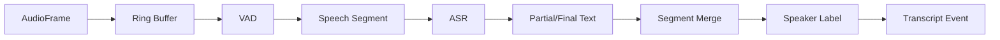

# 06 ASR、VAD、说话人分离设计

## 1. 目标

把实时音频转成结构化会议文本：

```text
音频帧 → 语音片段 → 转写文本 → 说话人标签 → 时间轴记录
```

## 2. 流程



## 3. VAD 设计

### 3.1 作用

VAD 用来判断哪里有人说话。

作用：

- 过滤静音；
- 降低 ASR 计算量；
- 切分语音片段；
- 降低整体成本。

### 3.2 输入输出

输入：

```python
AudioFrame(track="mic", data=pcm, sample_rate=16000)
```

输出：

```python
VadEvent(type="speech_start", track="mic", timestamp_ms=...)
VadEvent(type="speech_end", track="mic", timestamp_ms=...)
```

### 3.3 切片策略

建议：

```text
frame_duration: 30ms
min_speech_duration: 250ms
min_silence_duration: 500ms
max_segment_duration: 15s
```

太短会导致 ASR 上下文不足。

太长会导致实时性差。

## 4. ASR 设计

### 4.1 Provider 接口

```python
from abc import ABC, abstractmethod

class AsrProvider(ABC):
    @abstractmethod
    async def transcribe_segment(self, segment: "SpeechSegment") -> "AsrResult":
        pass
```

Result：

```python
class AsrResult(BaseModel):
    text: str
    language: str | None = None
    start_ms: int
    end_ms: int
    confidence: float | None = None
    is_final: bool = True
```

### 4.2 FunASR Provider

第一版优先实现 `FunAsrProvider`。

职责：

- 加载模型；
- 输入 wav/pcm；
- 输出文本；
- 尽量带标点；
- 后续支持热词。

### 4.3 Mock Provider

必须实现 `MockAsrProvider`。

用途：

- 前端开发；
- 测试 WebSocket；
- 没有模型时跑通流程。

示例：

```python
class MockAsrProvider(AsrProvider):
    async def transcribe_segment(self, segment):
        return AsrResult(
            text="这是一个模拟的会议转写内容。",
            start_ms=segment.start_ms,
            end_ms=segment.end_ms,
            is_final=True,
        )
```

## 5. Partial 与 Final

为了体验好，前端需要两类结果：

```text
partial：临时字幕，可变化
final：最终字幕，写入数据库
```

MVP 可先只做 final。

第二阶段再做 partial。

UI 表现：

- partial 用浅色显示；
- final 用正常颜色显示；
- final 后不能随意改动，除非触发修正事件。

## 6. 说话人标记

### 6.1 MVP

先只按 track 标记：

```text
mic → Me
system → Remote
```

### 6.2 第二阶段

对 system track 做 speaker diarization：

```text
Remote Speaker 1
Remote Speaker 2
Remote Speaker 3
```

### 6.3 第三阶段

声纹注册：

```text
用户提前给张三/李四录 10～30 秒样本
系统把 Speaker 1 匹配成张三
```

注意：

- 没有声纹或会议平台元数据时，不得自动显示真实姓名；
- 可以允许用户手动把 Speaker 1 重命名为“张三”。

## 7. Transcript Event Schema

```json
{
  "id": "uuid",
  "session_id": "uuid",
  "type": "transcript.final",
  "payload": {
    "segment_id": "uuid",
    "speaker": {
      "id": "me",
      "label": "Me",
      "source": "mic"
    },
    "track": "mic",
    "start_ms": 12000,
    "end_ms": 15200,
    "text": "这个需求如果下周上线，会不会影响支付流程？",
    "confidence": 0.92,
    "is_final": true
  }
}
```

## 8. 断句与合并

ASR 输出可能碎片化，需要合并。

规则：

- 同一 speaker；
- 时间间隔小于 800ms；
- 文本长度较短；
- 没有明显句末标点。

合并后写入 final transcript。

## 9. 标点和热词

MVP 可以依赖 ASR 模型自带标点。

后续可加：

- 标点恢复模型；
- 业务热词表；
- 用户词典；
- 项目名、人名、产品名修正。

热词配置：

```json
{
  "hotwords": ["Codex", "Tauri", "FunASR", "支付链路", "灰度发布"]
}
```

## 10. 延迟目标

| 阶段 | 目标 |
|---|---|
| VAD 响应 | < 300ms |
| ASR 首句 | 1～3s |
| final segment | 2～5s |
| UI 展示 | < 200ms |

## 11. 测试音频

准备测试数据：

```text
tests/fixtures/audio/
├── single_speaker_zh.wav
├── two_speakers_zh.wav
├── meeting_short_zh.wav
├── silence.wav
└── noisy_meeting.wav
```

测试项：

- 静音不触发 ASR；
- 单人音频能转写；
- 双轨音频能标记 mic/system；
- WebSocket 能收到 transcript.final；
- 长音频不会内存暴涨。

## 12. 验收标准

阶段 1：

- Mock ASR 跑通；
- Mic 音频经过 VAD 后生成 transcript；
- UI 展示实时字幕；
- SQLite 保存 transcript。

阶段 2：

- FunASR Provider 可用；
- 中文会议短音频能转写；
- system/mic 双轨能区分；
- diarization provider 有接口和 mock 实现。

阶段 3：

- system track 能分 Speaker 1/2；
- 用户可以手动重命名 speaker；
- 会后纪要使用 speaker label。
