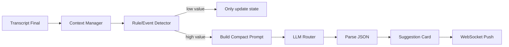

# 07 大模型会议建议引擎设计

## 1. 目标

大模型建议引擎不是聊天机器人，而是会议实时辅助系统。

它要解决：

```text
会议进行中，用户听到问题后不知道如何判断和回应。
```

输出要短、快、可执行。

## 2. 核心原则

```text
不要每句话都调用 LLM
不要把全量会议文本塞给 LLM
不要输出长篇分析
不要打断用户
只在高价值事件发生时提示
```

## 3. 整体流程



## 4. 上下文管理

### 4.1 短期上下文

最近 2～5 分钟发言。

用于理解当前话题。

### 4.2 中期摘要

每 3～5 分钟生成一次摘要。

用于压缩历史。

### 4.3 结构化状态

持续维护：

```json
{
  "current_topic": "支付系统改造",
  "decisions": [],
  "risks": [],
  "todos": [],
  "open_questions": [],
  "stakeholders": []
}
```

## 5. 事件识别

### 5.1 事件类型

```text
question：明确问题
risk：风险
decision：决策点
action_item：待办
objection：异议
requirement_change：需求变更
technical_unknown：技术未知
cost_concern：成本担忧
time_conflict：时间冲突
scope_conflict：范围冲突
business_opportunity：商业机会
```

### 5.2 规则识别

先用轻量规则。

示例：

```python
QUESTION_KEYWORDS = ["吗", "是不是", "能不能", "是否", "怎么", "为什么", "会不会"]
RISK_KEYWORDS = ["风险", "影响", "来不及", "不确定", "线上", "回滚", "异常", "兼容"]
TODO_KEYWORDS = ["谁来", "下周", "今天", "明天", "负责", "跟进", "确认一下"]
```

### 5.3 LLM 识别

如果规则命中但不确定，可以让小模型做分类。

输出：

```json
{
  "should_suggest": true,
  "event_type": "risk",
  "priority": "high",
  "reason": "当前发言涉及上线时间和支付链路稳定性"
}
```

## 6. 建议生成 Prompt

文件：`services/ai-service/app/prompts/suggestion_generator.md`

```text
你是会议实时辅助顾问。
你的任务不是总结全文，而是基于当前会议上下文，给用户提供简短、可执行的回应建议。

用户角色：{{user_role}}
会议场景：{{meeting_mode}}
当前会议主题：{{current_topic}}
会议状态：{{meeting_state}}
最近上下文：{{recent_transcript}}
当前触发事件：{{trigger_event}}

请输出 JSON，不要输出 Markdown。
字段：
- title: 建议标题，20字以内
- problem_essence: 当前问题本质，50字以内
- risk: 风险点，没有则为空
- suggested_reply: 用户可以直接说的话，3句话以内
- follow_up_question: 建议追问，没有则为空
- action_item: 是否形成待办，没有则为空
- priority: low | medium | high
```

## 7. 建议输出 Schema

```json
{
  "id": "uuid",
  "session_id": "uuid",
  "trigger_segment_id": "uuid",
  "type": "suggestion.created",
  "payload": {
    "title": "先确认支付链路影响范围",
    "problem_essence": "当前问题本质是上线时间和支付稳定性的冲突。",
    "risk": "如果未确认回滚方案，可能影响线上支付。",
    "suggested_reply": "我们先拆成影响范围和回滚方案两个问题确认。支付链路如果有改动，建议先灰度验证。",
    "follow_up_question": "这次改动是否会影响退款和老订单？",
    "action_item": "后端负责人梳理支付链路影响点。",
    "priority": "high"
  }
}
```

## 8. 角色模板

### 8.1 技术评审助手

关注：

- 架构边界；
- 数据一致性；
- 异常处理；
- 回滚方案；
- 性能影响；
- 安全风险；
- 可观测性；
- 上线灰度。

### 8.2 需求评审助手

关注：

- 目标用户；
- 业务价值；
- 边界条件；
- 验收标准；
- 优先级；
- 依赖方；
- 交付时间。

### 8.3 销售谈判助手

关注：

- 客户痛点；
- 预算；
- 决策链；
- 异议；
- 成交信号；
- 下一步动作。

### 8.4 管理会议助手

关注：

- 决策是否明确；
- 责任人是否明确；
- 截止时间是否明确；
- 风险是否闭环；
- 会议是否跑题。

## 9. 调用频率控制

建议规则：

```text
同类型建议 60 秒内最多 1 次
低优先级只更新状态，不弹卡片
高优先级立即弹出
会议开始前 30 秒不弹建议
用户可静音建议
```

## 10. LLM Router

配置：

```json
{
  "llm": {
    "provider": "openai-compatible",
    "base_url": "http://localhost:11434/v1",
    "model": "qwen2.5:7b",
    "api_key": "optional",
    "temperature": 0.2
  }
}
```

接口：

```python
class LlmProvider:
    async def complete_json(
        self,
        system_prompt: str,
        user_prompt: str,
        schema: dict,
    ) -> dict:
        pass
```

## 11. 成本控制

### 11.1 不要这样做

```text
每句话都调用 LLM
每次发送全部会议记录
输出一大段长建议
低价值闲聊也分析
```

### 11.2 应该这样做

```text
VAD 降低音频量
规则先筛选事件
短期上下文 + 摘要 + 状态
高价值才调用 LLM
限制输出长度
```

## 12. 失败处理

| 情况 | 处理 |
|---|---|
| LLM 超时 | 返回“建议生成超时，可重试” |
| JSON 解析失败 | 尝试 repair，一次失败后丢弃 |
| API Key 缺失 | UI 提示配置模型 |
| 频率过高 | 进入冷却队列 |
| 网络失败 | 不影响转写 |

## 13. 验收标准

第一阶段：

- 可以用 mock transcript 触发建议；
- 可以配置 OpenAI-compatible API；
- 建议以 JSON 解析；
- UI 能展示建议卡片。

第二阶段：

- 真实 ASR transcript 能触发事件；
- 事件识别不会每句话都弹；
- 建议能引用最近上下文；
- 会议结束能生成摘要。
